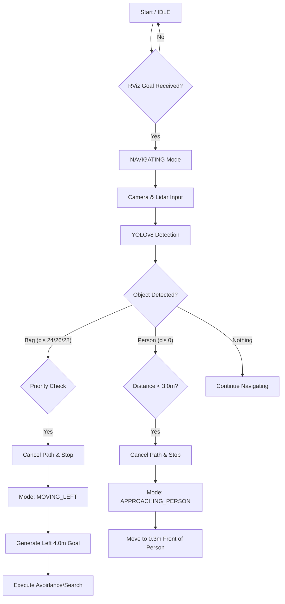

# 🤖 Smart Patrol & Search Robot (ROS2 Nav2 + YOLOv8)

이 프로젝트는 **ROS2 Humble**과 **NVIDIA Isaac Sim** 환경에서 구동되는 자율주행 정찰 로봇 시스템입니다.  
**YOLOv8** 기반의 객체 인식을 통해 사람과 유실물(가방)을 실시간으로 탐지하고, 상황에 맞춰 **접근(Approach)**하거나 **좌측 우선 탐색(Left-First Search)** 행동을 수행합니다.

---

## 📌 주요 기능 (Key Features)

### 1. 사람 인식 및 정밀 접근 (Person Approach)
* **탐지:** 로봇 전방 **3.0m** 이내에 사람이 감지되면 주행을 멈추고 접근 모드로 전환합니다.
* **제어:** 사람과의 충돌을 방지하면서도 상호작용이 가능한 **0.3m** 거리까지 정밀하게 접근하여 정지합니다.
* **알고리즘:** 로봇의 물리적 크기(반지름)를 고려한 Offset 계산으로 Nav2 경로 생성 실패를 방지했습니다.

### 2. 유실물 탐색 및 회피 (Bag Detection & Action)
* **탐지:** 배낭(Backpack), 핸드백(Handbag), 캐리어 등을 감지합니다.
* **행동:** 가방 발견 시 즉시 정지 후, **좌측(Left) 4.0m 지점**으로 이동하여 시야를 확보하거나 우회 경로를 생성합니다.
* **우선순위:** 사람과 가방이 동시에 감지될 경우, 유실물(가방) 처리를 최우선으로 합니다.

### 3. 강인한 주행 성능 (Robust Navigation)
* **지연 보정:** 시뮬레이션의 낮은 FPS(약 7Hz)로 인한 TF 지연(Time Lag)을 보정하는 Fallback 알고리즘을 적용했습니다.
* **장애물 극복:** Lidar 인식 범위 오류 수정 및 Costmap Inflation Radius 최적화(0.15m)를 통해 좁은 공간에서도 충돌 없이 주행합니다.

---

## 🛠️ 시스템 설계 (System Architecture)

### 전체 구조
시스템은 크게 **Perception(인식)**, **Decision(판단)**, **Control(제어)** 세 파트로 구성됩니다.

1.  **Perception:** Stereo Camera와 2D LiDAR 센서 데이터를 융합하여 YOLOv8로 객체를 식별합니다.
2.  **Decision:** `yolo_commander` 노드가 객체의 종류, 거리, 현재 로봇의 상태(Mode)를 분석하여 최적의 목표 지점(Goal Pose)을 계산합니다.
3.  **Control:** ROS2 Nav2(Navigation2) Action Server와 통신하며 경로를 생성하고 장애물을 회피하며 주행합니다.

### 🔄 알고리즘 플로우 차트 (Logic Flow)


## 💻 개발 환경 (Environment)

* **OS:** Ubuntu 22.04 LTS (Jammy Jellyfish)
* **Middleware:** ROS 2 Humble Hawksbill
* **Simulator:** NVIDIA Isaac Sim (5.0)
* **Language:** Python 3.10
* **Key Libraries:** `rclpy`, `nav2_simple_commander`, `ultralytics`, `cv_bridge`

## ⚙️ 사용 장비 (Hardware Setup)
pc: MSI Vector 16 HX AI A2XWIG-U9 QHD+
    CPU: 인텔 Ultra 9 275HX (인텔 AI 부스트, NPU)
    GPU: 엔비디아 지포스 RTX 5080 Laptop GPU (16GB GDDR7, 1,334 AI TOPS)
    RAM: 64GB

본 프로젝트는 **NVIDIA Isaac Sim**의 **Nova Carter** 로봇 모델을 기준으로 개발되었습니다.

| Component | Type | Topic / Spec |
| :--- | :--- | :--- |
| **Robot** | Nova Carter | Differential Drive Robot |
| **Vision** | Stereolabs ZED (Sim) | `/front_stereo_camera/left/image_raw` |
| **Lidar** | 2D RPLIDAR | `/front_2d_lidar/scan` (Range: 10.0m) |
| **Odom** | Wheel Odometry | `/odom` |

---

## 📦 의존성 설치 (Installation)

### 1. Python 필수 라이브러리 (`requirements.txt`)
YOLOv8 구동 및 이미지 처리를 위한 패키지입니다.

```bash
pip install ultralytics opencv-python numpy
```

### 2. ROS2 패키지 설치
Nav2 및 관련 패키지가 설치되어 있어야 합니다.

```bash
sudo apt update
sudo apt install ros-humble-navigation2 ros-humble-nav2-bringup ros-humble-cv-bridge
```
## 🚀 실행 순서 (How to Run)

전체 시스템을 구동하기 위해 아래 순서대로 터미널을 실행하세요.

### 1. Isaac Sim 실행 (Simulation)
Isaac Sim을 실행하고 `Nova Carter` 로봇과 맵(Warehouse 등)을 로드합니다.
* **ROS2 Bridge**가 활성화(Enable) 상태여야 합니다.

### 2. Nav2 Navigation Stack 실행
로봇의 위치 추정(AMCL) 및 경로 계획 서버를 실행합니다.
*(최적화된 `nav2_params.yaml` 파일 경로를 지정해야 합니다)*

```bash
# 터미널 1
source /opt/ros/humble/setup.bash
ros2 launch carter_navigation navigation_launch.py params_file:=/path/to/your/nav2_params.yaml
```
### 3. YOLO Commander 노드 실행 (Main Logic)
객체 인식 및 판단 제어 노드를 실행합니다.

```bash
# 터미널 2
source /opt/ros/humble/setup.bash
# 패키지 빌드 후 실행 (또는 python 스크립트 직접 실행)
ros2 run carter_navigation yolo_commander
```
## 🔧 문제 해결 (Troubleshooting)

### Q1. 로봇이 사람 앞에서 멈추지 않고 지나침.
* **원인:** 목표 지점이 로봇의 물리적 충돌 범위(Footprint) 내부에 찍혀 Nav2가 경로 생성을 거부한거 같음.
* **해결:** 코드 내 `calculate_map_pose` 함수의 `stop_offset` 값을 **0.3m 이상(권장 0.5m)**으로 설정하여 여유 공간을 확보.

### Q2. "No valid trajectories" 에러가 뜨며 움직이지 않습니다.
* **원인:** 장애물(사람/가방) 주위의 Inflation Radius(안전 구역)가 너무 넓어서 진입이 불가능한 상태.
* **해결:** `nav2_params.yaml` 파일에서 `local_costmap`과 `global_costmap`의 `inflation_radius` 값을 **0.15**로 줄임.

### Q3. 로봇이 장애물을 보고도 돌진하거나 Costmap에 길이 막힘.
* **원인:** Lidar 센서의 인식 범위 설정(`obstacle_max_range`) 오류인것 같음.
* **해결:** YAML 파일에서 `obstacle_max_range`가 `0.4`를  **3.0 이상(예: 10.0)**으로 수정.

### Q4. 시뮬레이션 렉(Lag)으로 로봇이 버벅거림.
* **해결:** `yolo_commander.py` 코드 내 `wait_for_server` 타임아웃을 **5.0초**로 늘리고, TF 변환 실패 시 Fallback 로직(Base_link 기준 좌표 계산)이 작동하도록 설정.

### 📧 Contact
* **Developer:** [kmgyun0707@gmail.com]
* **Project:** Autonomous Patrol & Search Robot with ROS2
